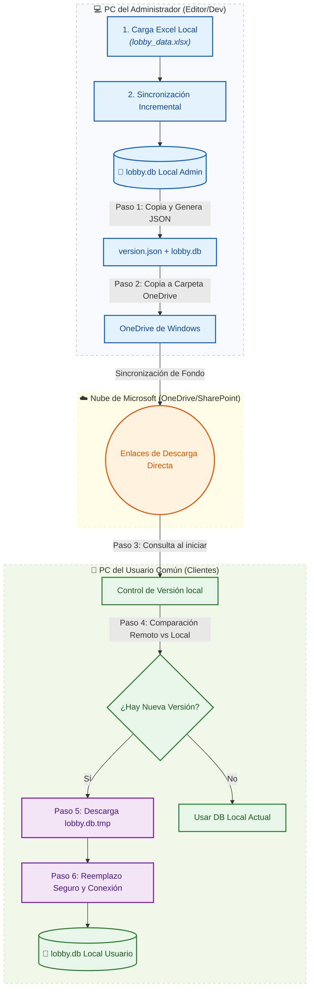

# 📊 Análisis y Propuesta: Sincronización Automática por Descarga de Base de Datos (`lobby.db`)

Para resolver el problema de la desincronización entre usuarios en una aplicación de escritorio descentralizada (construida con Electron + SQLite local por máquina) sin depender de servidores permanentes en producción ni bases de datos complejas en la nube (como Supabase), la **Alternativa B** plantea el uso de un almacenamiento en la nube institucional de archivos estáticos (como OneDrive/SharePoint) como "puente" para distribuir la base de datos ya actualizada.

---

## 🗺️ 1. Arquitectura de la Solución

Dado que SQLite compila todos sus datos en un único archivo físico (`lobby.db`), es posible distribuir la base de datos completa a los clientes de la misma manera en que se descarga una actualización de software.



---

## 🔄 2. Flujo Detallado del Sistema

### 📤 Fase A: El Administrador Actualiza y Publica
1. **Sincronización del Excel:** El Administrador inicia la sincronización de manera normal en su aplicación local. La app lee el Excel (`lobby_data.xlsx`) y actualiza la base de datos `lobby.db` local.
2. **Generación de Metadatos (`version.json`):** Al finalizar con éxito, el backend del Administrador genera un archivo JSON pequeño llamado `version.json` que registra la marca de tiempo de la actualización:
   ```json
   {
     "last_import_timestamp": "24-06-2026 12:00",
     "db_size": 2544211,
     "db_hash": "fa5b4b1a8d"
   }
   ```
3. **Copia a Carpeta Sincronizada:** El backend copia tanto `lobby.db` como `version.json` a una subcarpeta del OneDrive institucional del administrador configurada en Windows (ej. `C:\Users\...\OneDrive - Ilustre Municipalidad de Maipú\LobbyControlShared\`).
4. **Sincronización Automática a la Nube:** El cliente de OneDrive de Windows del Administrador se encarga de subir de forma transparente ambos archivos a la nube en segundos.

### 📥 Fase B: El Usuario Común Inicia la Aplicación
1. **Verificación de Versión:** Cuando un usuario abre la aplicación en su PC, el backend Express realiza un `fetch` rápido de la URL de descarga directa del archivo `version.json` remoto.
2. **Comparación Local vs. Remota:**
   * La app consulta el `last_import_timestamp` actual en su propia base de datos SQLite (en la tabla `configuracion`).
   * Compara este valor con el campo `last_import_timestamp` del `version.json` remoto.
3. **Descarga y Reemplazo (Si aplica):**
   * Si la marca de tiempo remota es más nueva que la local, se inicia el proceso de actualización.
   * La app descarga el archivo `lobby.db` remoto desde el enlace directo y lo escribe como un archivo temporal `data/lobby.db.tmp`.
   * Para evitar la corrupción del archivo, la aplicación:
     1. Cierra todas las conexiones activas a la base de datos local SQLite actual.
     2. Reemplaza el archivo físico `data/lobby.db` por `data/lobby.db.tmp`.
     3. Vuelve a inicializar y conectar la base de datos en Express.
   * La interfaz del usuario se recarga automáticamente reflejando los nuevos datos.

---

## ⚙️ 3. Requisitos de Configuración en OneDrive/SharePoint

Para que la app de los usuarios pueda descargar los archivos sin autenticación interactiva compleja, el administrador debe configurar enlaces compartidos con permisos de lectura para la organización o de forma pública.

> [!TIP]
> ### 💡 Cómo generar Enlaces de Descarga Directa
> Para que una petición HTTP `GET` de Node.js pueda descargar el archivo binario directamente (sin que Microsoft renderice una página web con botones), el enlace de OneDrive/SharePoint debe ser modificado:
>
> 1. **SharePoint / OneDrive Institucional (Maipú):**
>    * Al compartir el archivo, genera un enlace que permita el acceso a "Cualquier persona con el enlace" o "Usuarios de tu organización".
>    * Un enlace de SharePoint común se ve así:
>      `https://municipalidadmaipu-my.sharepoint.com/:u:/g/personal/usuario_maipu_cl/EVg12345...?e=4xyz`
>    * Para transformarlo en descarga directa, se reemplaza la parte central del enlace o simplemente se le añade el parámetro `&download=1` al final:
>      `https://municipalidadmaipu-my.sharepoint.com/:u:/g/personal/usuario_maipu_cl/EVg12345...?download=1`
> 2. **OneDrive Personal (Fallback):**
>    * En OneDrive personal se puede generar el código de inserción (Embed) del archivo y cambiar `/embed?` por `/download?`.

---

## 🛠️ 4. Cambios Técnicos Propuestos en el Código

### 📁 4.1 En el Servidor (`server.js` y `import_lobby.js`)

#### A. Exportación Automática en el Administrador
Modificar el script de importación para copiar los archivos a la carpeta OneDrive en Windows una vez completado el proceso:

```javascript
// scripts/import_lobby.js
function finalizeImport() {
  // ... lógica actual ...
  if (totalChanges > 0) {
    saveLastImportTimestamp((err) => {
      // Generar el archivo version.json
      const mtime = new Date();
      const timestampStr = `${dd}-${mm}-${yyyy} ${hh}:${min}`;
      const versionData = {
        last_import_timestamp: timestampStr,
        db_size: fs.statSync(dbPath).size,
        db_hash: calculateFileMd5(dbPath)
      };
      
      fs.writeFileSync(path.join(path.dirname(dbPath), 'version.json'), JSON.stringify(versionData, null, 2));

      // Si existe ruta de OneDrive configurada, copiar los archivos
      if (process.env.ONEDRIVE_SYNC_PATH) {
        try {
          const destDb = path.join(process.env.ONEDRIVE_SYNC_PATH, 'lobby.db');
          const destJson = path.join(process.env.ONEDRIVE_SYNC_PATH, 'version.json');
          fs.copyFileSync(dbPath, destDb);
          fs.copyFileSync(path.join(path.dirname(dbPath), 'version.json'), destJson);
          console.log('✓ Copiado exitoso a OneDrive para distribución automática.');
        } catch (copyErr) {
          console.error('Error al copiar a la ruta de OneDrive:', copyErr.message);
        }
      }
      nextStep();
    });
  }
}
```

#### B. Sincronizador Automático en Clientes (al iniciar)
Implementar una función de inicialización en `server.js` que verifique la versión en la nube antes de levantar la base de datos o en segundo plano:

```javascript
// src/config/db-sync.js (Nueva Utilidad)
const fs = require('fs');
const path = require('path');
const https = require('https');

function downloadFile(url, destPath) {
  return new Promise((resolve, reject) => {
    const file = fs.createWriteStream(destPath);
    https.get(url, (response) => {
      if (response.statusCode !== 200) {
        return reject(new Error(`Error de descarga: Código ${response.statusCode}`));
      }
      response.pipe(file);
      file.on('finish', () => {
        file.close(resolve);
      });
    }).on('error', (err) => {
      fs.unlinkSync(destPath);
      reject(err);
    });
  });
}

async function checkAndSyncDatabase(dbConnectionManager) {
  const versionUrl = process.env.REMOTE_VERSION_URL;
  const dbUrl = process.env.REMOTE_DB_URL;
  
  if (!versionUrl || !dbUrl) {
    console.log('Sincronización remota desactivada (falta configuración de URLs).');
    return;
  }

  const localVersionPath = path.join(__dirname, '../../data/version.json');
  const localDbPath = path.join(__dirname, '../../data/lobby.db');
  const tempDbPath = path.join(__dirname, '../../data/lobby.db.tmp');
  const tempVersionPath = path.join(__dirname, '../../data/version.json.tmp');

  try {
    // 1. Descargar version.json remoto
    await downloadFile(versionUrl, tempVersionPath);
    const remoteVersion = JSON.parse(fs.readFileSync(tempVersionPath, 'utf8'));
    
    // 2. Leer versión local actual
    let localVersion = { last_import_timestamp: 'Nunca' };
    if (fs.existsSync(localVersionPath)) {
      localVersion = JSON.parse(fs.readFileSync(localVersionPath, 'utf8'));
    }

    // 3. Comparar marcas de tiempo
    if (remoteVersion.last_import_timestamp !== localVersion.last_import_timestamp) {
      console.log(`Nueva base de datos detectada en la nube (${remoteVersion.last_import_timestamp}). Iniciando descarga...`);
      
      // 4. Descargar nueva base de datos
      await downloadFile(dbUrl, tempDbPath);
      console.log('Descarga completa. Reemplazando base de datos local...');
      
      // 5. Reemplazar archivos con exclusión mutua (Cerrando SQLite previamente)
      await dbConnectionManager.closeConnection();
      
      fs.copyFileSync(tempDbPath, localDbPath);
      fs.copyFileSync(tempVersionPath, localVersionPath);
      
      fs.unlinkSync(tempDbPath);
      fs.unlinkSync(tempVersionPath);
      
      await dbConnectionManager.openConnection();
      console.log('✓ Base de datos sincronizada y cargada con éxito.');
    } else {
      console.log('Base de datos local al día.');
      fs.unlinkSync(tempVersionPath);
    }
  } catch (err) {
    console.error('Error durante la sincronización automática:', err.message);
  }
}
```

---

## 📈 5. Análisis de Impacto y Viabilidad

| 🔍 Criterio | 📋 Impacto / Solución Técnica | 💡 Evaluación |
| :--- | :--- | :--- |
| **💰 Costos** | Se utiliza la suscripción existente de Microsoft 365 / OneDrive de la Municipalidad. No requiere contratar hosting ni bases de datos. | 🟢 **$0 USD (Sin costos adicionales)** |
| **🔒 Seguridad** | Los archivos se alojan en la nube corporativa de la municipalidad. No se exponen credenciales de bases de datos críticas en el código de la app. | 🛡️ **Seguridad Corporativa** |
| **⭐ Usabilidad** | Excelente para los usuarios. Ellos solo hacen doble clic al icono de la app y esta se actualiza sola al iniciar, garantizando que siempre busquen información fidedigna. | 🚀 **Transparente y Automático** |
| **🛠️ Mantenimiento** | Bajo. Solo requiere que el administrador conserve el archivo Excel maestro y no elimine la carpeta de OneDrive compartida. | 📉 **Mantenimiento Muy Bajo** |

---

## 📋 6. Siguientes Pasos propuestos para la Implementación

* [ ] **Crear carpeta compartida en OneDrive Maipú:** Generar una carpeta (ej. `LobbyControlData`) y obtener los enlaces de descarga directa para los archivos ficticios `lobby.db` y `version.json`.
* [ ] **Definir Variables de Entorno (.env):**
  * **Administrador:** `ONEDRIVE_SYNC_PATH=C:\Users\...\OneDrive...\LobbyControlData`
  * **Usuarios (Clientes):**
    * `REMOTE_VERSION_URL=https://.../version.json?download=1`
    * `REMOTE_DB_URL=https://.../lobby.db?download=1`
* [ ] **Modificar el Administrador de Conexión de SQLite:** Permitir el cierre y reapertura dinámico del archivo `lobby.db` de forma limpia sin colgar peticiones en Express.
* [ ] **Agregar el flujo de descarga en Express:** Ejecutar la verificación justo antes de la inicialización de la interfaz en Electron.
