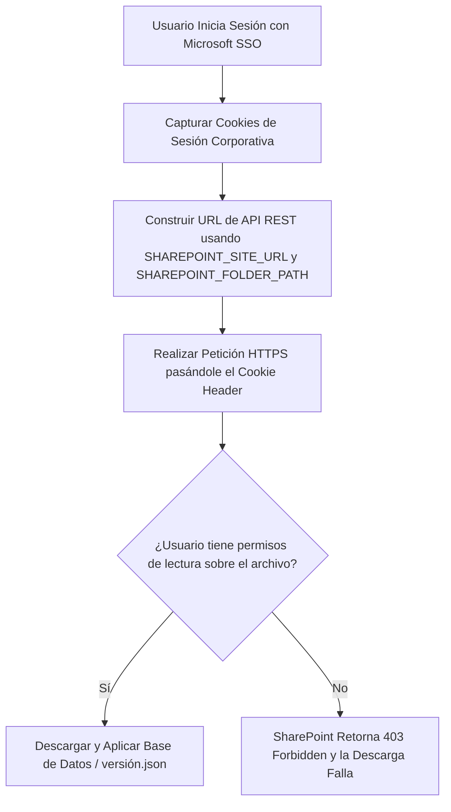

# Diseño Arquitectónico: Descarga Segura vía API REST de SharePoint

Este documento detalla la solución implementada para eliminar el uso de enlaces de invitado y securizar la descarga de la base de datos desde SharePoint.

---

## 🔒 El Problema de Seguridad Corregido
Anteriormente, la aplicación utilizaba enlaces de tipo **"Invitado / Acceso Público"** (`guestaccess.aspx`) de SharePoint quemados como fallback en el código fuente. Cualquier persona con acceso al ejecutable compilado podía extraer estas URLs y descargar la base de datos con toda la información histórica de Lobby Control de forma anónima.

**Estado**: **SOLUCIONADO**. Se eliminaron todos los enlaces de invitado tanto del archivo `.env` como del código fuente.

---

## 🛠️ Solución Implementada: API REST de SharePoint Nativa

Modificamos el módulo de sincronización [`src/config/db-sync.js`](file:///c:/Users/abarrazaj/OneDrive%20-%20Ilustre%20Municipalidad%20de%20Maipú/Documentos/Antigravity/Lobby/src/config/db-sync.js) para que construya dinámicamente las rutas de descarga oficiales utilizando la API REST de SharePoint (`GetFileByServerRelativeUrl`).

El flujo opera de la siguiente manera:

### Variables de Entorno Utilizadas (`.env`):
El sistema ahora depende exclusivamente de las variables estándar de tu sitio de SharePoint:
* `SHAREPOINT_HOST`: El dominio corporativo (`immaipu.sharepoint.com`).
* `SHAREPOINT_SITE_URL`: La URL del sitio de la unidad (`https://immaipu.sharepoint.com/sites/SECMU`).
* `SHAREPOINT_FOLDER_PATH`: La ruta interna del directorio del servidor (`/sites/SECMU/Lobby/LobbyControl`).

### Construcción Dinámica de URLs en Caliente:
* **Para versión.json**:
  `${SHAREPOINT_SITE_URL}/_api/web/GetFileByServerRelativeUrl('${SHAREPOINT_FOLDER_PATH}/version.json')/$value`
* **Para lobby.db**:
  `${SHAREPOINT_SITE_URL}/_api/web/GetFileByServerRelativeUrl('${SHAREPOINT_FOLDER_PATH}/lobby.db')/$value`

---

## 📈 Beneficios del Cambio
1. **Sin Enlaces Compartidos**: No es necesario generar ni mantener enlaces compartidos de ningún tipo (ni públicos ni de personas determinadas). Los archivos permanecen privados en su carpeta de SharePoint.
2. **Seguridad Nativa**: SharePoint se encarga de autorizar la descarga en base a los permisos individuales que tenga el usuario autenticado sobre el archivo `lobby.db`.
3. **Control de Acceso Multidepartamento**: Si un usuario de otra unidad municipal inicia sesión mediante SSO y tiene acceso compartido directamente al archivo en SharePoint (pero no al sitio SECMU), la descarga funcionará de manera segura y transparente.
